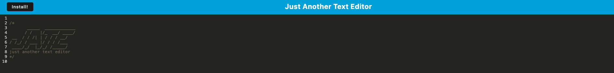

# hw-19-pwa-text-editor

Build a progressive web app that works offline and bundles code to create text editor app!

## Description
  *  Use webpack to bundle code and create a web app upon launch.
  *  Cache data and reload it when coming back to the page. 
  *  Create Service worker to run offline. 
  
  ## Table of Contents
  * [Installation](#installation)
  * [Usage](#usage)
  * [Contributing](#contribution)
  * [Questions](#questions)
  * [Obstacles](#obstacles-and-successes)
  
  ## Installation

  * Clone the repo - https://github.com/Soko77788/hw-19-pwa-text-editor.git
  * Navigate your terminal to that project and run npm i to install node_modules
  
  ## Usage
  * Internet required initially
  * Run npm start to run the client build and start the server 

  ## Contributing
  * Create a pull request

  ## License
   

This project is unlicensed. 

  
  ## Questions
  * Here is a link to my [GitHub](https://github.com/soko77788) profile.
  * For further questions email me at nicksoko@gmail.com.

  ## Tools and 3rd party assistance
  * Influenced with the week 19 PWA class mini project. 
   
   

  ## Obstacles and Successes
  * A lot of foreign concepts and words in this weeks module
  * Reading documentation to carefully get all the syntax right 
  * Importing so many little plugins with webpack and making them all work together.
  * Even following the class mini project closely still left me with a bunch of errors.
  * Instructor was even confused at points and needed to create work arounds which is even harder to follow 

  * Following the in class project helped set up most of the assignment
  * Getting the server running and the page displaying but working through errors
  

  ## Link to deployed app 

  https://hw-19-pwa-text-editor-4iif.onrender.com
  